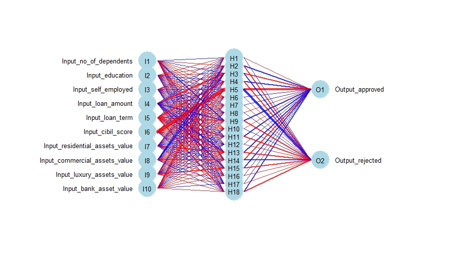

[Back to Mitchel Daniel's portfolio](https://mitcheljamesdaniel.github.io/)

# __Four Machine Learning Classifiers in R__

In this tutorial, I'll discuss 4 widely-used machine learning classifiers and show you how to implement them in R. I'll use a worked example to demonstrate some of the strengths and weaknesses of each classifier when it comes to flexibility, interpretability, computation time, and visualization options. My goal is to provide a concise, high-level primer for getting started with machine learning classification. So I will be light on theory, focusing on the practical concerns related to choosing the right classifier and applying it to your dataset.

If you're interested, you can check out the [code and data](https://github.com/mitcheljamesdaniel/Classifiers_in_R) underlying this tutorial to see how it all works for yourself.

## What is a Machine Learning Classifier?

In machine learning, a classifier is a predictive model that attempts to accurately categorize data into one of multiple classes. Common examples include classifying emails as 'spam' or 'not spam', predicting whether or not a loan is likely to be repaid, or identifying whether or not a patient has a particular disease. The variable being predicted is commonly referred to as the target variable, and the variables being used to predict the target are the predictors or features.

Many different classification algorithms exist, and there is no robust theory for determining which algorithm will be best for a given problem. That means it is usually best to identify multiple classifiers that are suitable to your data set and project goals. Different classifiers work well with different kinds of input data and can reveal different kinds of patterns in your data. We'll look at some of the main things to consider when deciding which classifiers are suitable for a given project. After you've identified some suitable classifiers, you can try them out compare their performance to determine which one works best.

When comparing the performance of different classifiers, classification accuracy (i.e. the proportion of cases that are accurately categorized by the model) can be a great place to start. However, accuracy can be misleading if your dataset is imbalanced (i.e. if certain classes are much more common than others). If you are dealing with an imbalanced dataset, check out <link to repo with imbalanced learning tutorial> to learn about other metrics of model performance that more meaningfully capture model performance, and several techniques for training models effectively on imbalanced data.

## Binary Classification

In this tutorial, I will focus on binary classification, which is when the target variable has two possible classes. Multi-class problems, in which there are three or more classes, are also common. My tutorial on [imbalanced learning](https://mitcheljamesdaniel.github.io/projects/Imbalanced_Learning_Tutorial/index.html) gives some examples of how to perform multi-class classification in R.

In binary classification, one class is considered the 'normal' state and assigned a value of 0; the other class is considered the 'abnormal' state and assigned a value of 1. Generally speaking, classifiers use the Bernoulli probability distribution, which represents the situation where an event has a binary outcome, 0 or 1. 

<have equation for Bernoulli probability function that uses q and p>

In essence, many classifiers model the probability (p) that a given case belongs to the abnormal state, which in turn determines the probability that the case belongs to the normal state (q = 1 - p).

```{r setup, include = FALSE}
library(knitr)
library(rmarkdown)
knitr::opts_chunk$set(echo = TRUE, message = FALSE, warning = FALSE)
```

## Using Loan Approvals to Explore Classifiers

For this tutorial, we will use the Loan Approval Prediction [dataset](https://www.kaggle.com/datasets/architsharma01/loan-approval-prediction-dataset) provided by Kai on Kaggle.com. With this dataset, we can use classifiers to predict whether or not loans were approved based on financial records and associated information that is commonly used to determine eligibility. 

This dataset takes just a tiny bit of cleaning before it is ready to use. The dataset is tidy, has no duplicated cases, and no missing values. Several numerical variables should be type factor, so we convert these. We also drop an arbitrary key column that has no use in our analyses.

```{r read in and clean data}

library(readr)
library(dplyr)

#read in the dataset as a data frame
loan_data <- as.data.frame(read_csv("loan_approval_dataset.csv"))

#check that data is tidy
head(loan_data)

#check whether there are duplicates
sum(duplicated(loan_data))

#check whether there are missing data
anyDuplicated(loan_data)

#convert variables that should be type factor
factors_vector <- c("education", "self_employed", "loan_status")
for(i in factors_vector){
  loan_data[[i]] = as.factor(loan_data[[i]])
}

#loan_id is an arbitrary key that we will not use in any analyses, so we drop that column
loan_data <- loan_data %>%
  mutate(loan_id = NULL)

```

Next, I visualize the distribution of the target variable to see how many observations are in each class. There are more approved loans (2656) than rejected loans (1613) in our dataset, but the difference is mild enough that we can consider the dataset to be  balanced.

``` {r visualize_target_variable}

library(ggplot2)

#visualize distribution of target variable
ggplot(loan_data, aes(x = loan_status, fill = loan_status)) +
  geom_bar() +
  labs(x = 'loan status') +
  scale_x_discrete(labels=c('approved', 'rejected')) +
  theme_classic(base_size = 15) +
  theme(legend.position = "none")

```

Next, I examine the relationship between each pair of features. As we can see in the correlogram, annual income is strongly correlated (r > 0.9) with both loan amount and luxury assets. We can exclude this redundant variable to enhance model accuracy and reduce computation time.

``` {r feature selection}

library(corrplot)

#create data frame of just continuous predictors, excluding fetal movement and severe decelerations because of too many repeated values
cont_predictors = loan_data[,1:11] %>%
  mutate(education = NULL,
         self_employed = NULL)
#create correlation matrix
corrs <- round(cor(cont_predictors), 2)
#create correlelogram, with no/weak correlations in grey, strong positive correlations in blue, and strong negative correlations in red
col <- colorRampPalette(c("#BB4444", "#EE9988", "#D3D3D3", "#77AADD", "#4477AA"))
corrplot(corrs, method="color", col=col(200),  
         type="upper", order="hclust", 
         addCoef.col = "black", # Add coefficient of correlation
         tl.col="black", tl.srt=45, #Text label color and rotation
         #hide correlation coefficient on the principal diagonal
         diag=FALSE,
         tl.cex = .65, #text label size
         number.cex=0.65, #number label size
         cl.cex = 0.65)

#drop income_annum from the data frame
loan_data_reduced <- loan_data %>%
  mutate(income_annum = NULL)

```

Our dataset is now ready to analyze, so let's dive into the first classifier.


## Logistic Regression

### How does logistic regression work?

Logistic regression estimates the probability that a given case belongs to each class by fitting a sigmoid function - i.e. an S-curve - to the data. A logistic regression model is fit by tuning the coefficients for each term in the model, which are log odds (the probability of an abnormal event divided by the probability of a normal event). Once the optimal coefficients are found, they can be used to calculate the conditional probability of an abnormal event for a given case. Cases with a probability less than 0.5 are predicted to be 0 ('normal'), and those above 0.5 are predicted to be 1 ('abnormal').

### When is logistic regression useful?

Logistic regression is used for binary classification, though a related techniques exist for multiclass regression (multinomial regression for 3 or more unordered classes, and ordinal regression for 3 or more ordered classes). Logistic regression is relatively flexible in that can handle both continuous and categorical features, and does not make any assumptions about the distribution of the features. Because logistic regression models are relatively simple, they are easy to implement, fast to run, less prone to overfitting, and more straightforward to interpret compared to most other classifiers.

Since logistic regression fits a single sigmoid function, it performs well with datasets that are linearly separable. Data are linearly separable if it is possible to draw a single line within the multidimensional space of the features that perfectly splits the two classes from one another. However, real-world datasets are often noisy, meaning that linearly separable data are uncommon. Logistic regression also assumes that independent variables are linearly related to the log odds, so logistic regression tends to perform poorly on data in which there is a complex relationship between the features and the target.

### Implementing logistic regression

Let's split the data into training (80%) and testing (20%) sets.

``` {r partition_data}

#set the seed so that data partitioning is reproducible
seed = 437
set.seed(seed)

#create vector of indices for randomly subsetting rows
#although the indices are sampled with replacement, cases are ultimately sampled without replacement (i.e. each case is placed in either the training or testing set, never both)
partition_ind <- sample(2, nrow(loan_data_reduced), replace = TRUE, prob = c(0.8, 0.2))
#subset using the indices
loan_train <- loan_data_reduced[partition_ind == 1,]
loan_test <- loan_data_reduced[partition_ind == 2,] 

```

Any of the features that remain in our dataset could be informative about the target variable, so we include them all in the initial model. Additionally, interactions between any of the features could be informative, so we include two-way interaction terms. To keeps things simple for this tutorial, we won't include higher-order interactions. Including higher-order interactions can increase the model's performance, but also increases computation time and reduces interpretability. Additionally, increasing the number of terms in your model above roughly one tenth the number of cases is not recommended because the risk of overfitting becomes much higher. We have 10 features, so including the intercept, all main effects, and all 2-way interactions gives us 11 + (10 choose 2) = 56 coefficients in our model, which keeps the ratio of coefficients to cases (56:3455) well below the 1:10 rule-of-thumb cut-off.

``` {r fit logistic regression, warning = TRUE}

log_reg <- glm(loan_status ~ (no_of_dependents + education + self_employed + loan_amount + loan_term + 
                              cibil_score + residential_assets_value + commercial_assets_value + luxury_assets_value +
                              bank_asset_value)^2, #include all two-way interactions
               data = loan_train,
               family = "binomial")

```

Running this model throws the warning "fitted probabilities numerically 0 or 1 occurred". This warning means that there is complete separation: there are certain feature values at which our model perfectly predicts whether the loan was approved or rejected, resulting in conditional probabilities of 0 or 1. This isn't necessarily a bad thing - in fact, complete separation often arises when the model is really good at predicting the target variable. However, when there is complete separation, Wald tests and likelihood ratio tests will give biased results. AIC is still reliable, so we will use AIC for backward stepwise model reduction. AIC as the measure of model performance, which is an estimate of prediction error that accounts for the trade-off between model accuracy and model simplicity. A smaller AIC suggests a better model. 

Model reduction is a large and complex topic unto itself, but in essence backward stepwise model reduction consists of (i) starting with the full model (or a model containing as many terms as is feasible), (ii) removing the term that leads to the greatest improvement in the model, and (iii) repeating this until removing any term no longer significantly improves the model. We will use MASS::stepAIC() to automate backward stepwise model selection.

``` {r model_reduction, results = FALSE}

library(MASS)

#perform backwards stepwise model reduction by AIC
reduced_log_reg <- stepAIC(log_reg)

```

Using this model reduction technique results in a much-reduced model with a total of `r length(reduced_log_reg$coefficients)` coefficients. Since stepwise model reduction eliminates terms that do not significantly improve the model, it is now worth examining the remaining features and interaction terms to learn what information they provide about the target variable.

### Validating logistic regression

Before we start interpreting the model, we should examine how well it performs on the testing set. We can generate model predictions using insight::get_predicted(). Then, we can use caret::confusionMatrix() to calculate a wide range of commonly-used performance metrics. Our model performs very well according to all these metrics. In the real-world, it is generally a good idea to train and test your model multiple times on different partitionings of the data, to ensure that your model isn't biased by which cases happened to end up in the training and testing set.

``` {r validate logistic regression}

library(insight)
library(caret)

#get predictions for the testing set
log_predictions <- get_predicted(reduced_log_reg, loan_test)
#convert probabilities into binary expectations
predictions_status <- as.factor(ifelse(log_predictions >= 0.5, "Rejected", "Approved"))
#calculate model performance metrics
caret::confusionMatrix(predictions_status, loan_test$loan_status, mode = "everything", positive = "Rejected")

```

### Interpreting logistic regression

Let's convert the coefficients from log odds to (proportional) odds ratios, which is more intuitive to interpret. For every one unit increase in a feature, the probability that the case is in the abnormal class increases by a factor equal to the odds ratio. 

``` {r obtain_log_odds}

#convert log odds to odds ratios
odds_ratios <- exp(reduced_log_reg$coefficients)
#print terms with the 6 highest odds ratios
odds_ratios

```

For example, according to the model, increasing the loan term by 1 year increases the probability that the loan will be rejected by `r round(head(sort(odds_ratios, decreasing = TRUE))[1], 2)` times, all else being equal. 

The fact that logistic regression calculates a log odds for each term in the model makes interpretation relatively straightforward. All else being equal, the bigger the lod odds ratio, the more important the term (though don't forget to account for differences in the range of the feature - more on this below). As we discussed above, logistic regression assumes that the data are best represented by a logistic curve, so it calculates a single odds ratio for each term in the model.

### Visualizing logistic regression

Since our model has many features, we may want a way to visualize the relationship between one or two features and the target variable, while holding other variables constant. Fortunately, logistic regression is straightforward to visualize because we can use the model to calculate the probability of different classes for a given input.

A common method for obtaining probabilities from a logistic regression model is to use modelr::data_grid() and modelr::add_predictions(). However, we have too many unique value combinations in our features for this method to work. Instead, we can use modelbased::visualisation_matrix() to generate a grid of values for one or more features, and insight::get_predicted() to calculate the model's predictions for that grid of values. The predictions are the probability that the loan is rejected. Since we are ultimately interested in predicting a binary outcome, I convert the probabilities into binary expectations ("approval" or "rejection"). Then, we can clearly plot the relationship between the feature of interest, the predicted probability, and the expected loan status.

In the plot below we can see that CIBIL score, which is a summary of a person's credit history, unsurprisingly has a very large impact on the probability that a loan will be approved. You'll notice that CIBIL score has a relatively small odds ratio in our model (`r odds_ratios[6]`), yet a big impact on the predictions. This is because CIBIL score has a large range (`r range(loan_train$cibil_score)`), and the odds ratio describes the factor by which the model's prediction changes for each unit increase in the feature. This is one reason why it's helpful to consider the range (and to visualize the feature) when interpreting the odds ratio.

``` {r visualize single feature predictions}

library(modelbased)

#generate grid of evenly-spaced values for a feature of interest, with the mean value for every other feature
my_grid <- loan_train[1:10] %>%
  visualisation_matrix("cibil_score", length = 600, factors = "median", numerics = "median")
#obtain predictions for each row in the grid
cibil_score_predictions <- get_predicted(reduced_log_reg, my_grid, predict = "expectation")
#combine grid of cibil scores and predictions into one dataframe
grid_and_predictions <- as.data.frame(cbind(my_grid$cibil_score, cibil_score_predictions))
colnames(grid_and_predictions) <- c("cibil_score", "predicted_probability_of_rejection")
#convert probabilities into binary expectations
grid_predictions_status <- grid_and_predictions %>%
  mutate(predicted_loan_status = case_when(predicted_probability_of_rejection >= 0.5 ~ "rejected",
                                           predicted_probability_of_rejection < 0.5 ~ "approved"))

#plot conditional probability of loan rejection for each row in the grid
grid_predictions_status %>%
  ggplot(aes(x = cibil_score, y = predicted_probability_of_rejection, color = predicted_loan_status)) +
  geom_point(size = 1.5) +
  labs(x = 'cibil score',
       y = 'predicted probability of rejection') +
  guides(color=guide_legend(title="predicted loan status")) +
  theme_classic(base_size = 15)

```

We can also visualize the joint effect of two or more features on the model's predictions, which is useful for features like education and loan term that interact with one another. Visualizing the effect of these variables reveals that being a graduate is associated with increased odds of rejection for a short-term loan, but decreased the odds of rejection for a long-term loan. Note that in this figure the probability of loan rejection is always lower than the average in our dataset, and the curves appear exponential rather than logistic. This is because we are only visualizing the effects of these two features at the median value of all other features in the dataset. As this example illustrates, it's important to interpret visualizations of 1 or two features with a grain of salt when dealing with a multivariate dataset.

``` {r visualize two features}

#generate grid for two features
two_grid <- loan_train[1:10] %>%
  visualisation_matrix(c("loan_term", "education"), length = 50, factors = "median", numerics = "median")
#obtain predictions
term_education_predictions <- get_predicted(reduced_log_reg, two_grid, predict = "expectation")
#combine grid and predictions into one dataframe
two_grid_and_predictions <- as.data.frame(cbind(two_grid$loan_term, two_grid$education, term_education_predictions))
colnames(two_grid_and_predictions) <- c("loan_term", "education", "predicted_probability_of_rejection")
two_grid_and_predictions$education <- as.factor(two_grid_and_predictions$education)

#plot conditional probability of loan rejection for both features
two_grid_and_predictions %>%
  ggplot(aes(x = loan_term, y = predicted_probability_of_rejection, group = education, color = education)) +
  geom_line(linewidth = 1.5) +
  labs(x = 'loan term',
       y = 'predicted probability of rejection') +
  guides(color=guide_legend(title="education")) +
  scale_color_manual(labels = c("Graduate", "Not graduate"),
                     values = c("green", "brown")) +
  theme_classic(base_size = 15)

```


## Random Forest

### How does random forest work?

To understand random forest, we first need to understand decision trees. A decision tree is a hierarchical model, like a flowchart, in which the cases in the dataset are divided into smaller and smaller groups as efficiently as possible using consecutive, binary criteria. If used for classification, each leaf node (i.e. the tips of the tree) typically constitutes a sub-group of cases that all, or mostly, belong to a single class of the target variable. A decision tree can be used to predict class membership for a given case by following the decisions through the tree until reaching a leaf node, and then assigning the class label that is most common in that leaf node to the case.

As the name suggests, a random forest consists of multiple decision trees. A random forest predicts class membership by aggregating the predictions of individual trees (usually by assigning the class label that is predicted by the most trees). When fitting each tree, data are sampled from the training set with replacement so that the data used for different trees are not identical. This sampling process is called "bagging". Random forest also uses feature randomness, meaning that only a random subset of the features in the dataset are eligible when determining how to optimally split the data for a given tree. Bagging and feature randomness help to ensure that trees are uncorrelated with one another. This is important because decision trees are prone to overfitting. By aggregating many, uncorrelated trees, random forest has a dramatically reduced risk of overfitting. Note that bagging is less effective at reducing overfitting if cases are correlated with one another (e.g. if multiple measurements are taken on the same individual). In our scenario, each case is a loan application from a different individual, so we don't have to worry about correlated cases.

### When is random forest useful?

Random forest can be used for both classification and regression tasks, though we will focus just on classification. Random forest is an extremely versatile machine learning technique because it can handle any combination of continuous and quantitative features, and it makes no assumptions about the distribution of the features, the target variable, or their relationships with one another. Additionally, because bagging and aggregating uncorrelated trees are used in random forest, this technique is less prone to overfitting or bias compared to many other machine learning methods.

The primary draw-back of random forest is lack of interpretability. The model is really a set of decision trees, and so it is very difficult to intuitively summarize a random forest. If the goal is simply to produce a model that generates robust predictions, random forest may be a great option. However, if the goal is to understand the underlying relationship between the features and the target variable, then other machine learning techniques will be better options. 


### Implementing random forest

Several hyperparameters are set by the data scientist, which control how the random forest learns. We can set the minimum size of leaf (terminal) nodes. A higher value makes the random forest run faster, but tends to reduce performance. We can determine the number of trees. More trees takes longer, but leads to less error and less overfitting. We can also set the number of features sampled per tree. Too few candidate features leads to models with low accuracy; too many makes the trees similar to one another, increasing the risk of overfitting.

In our case, the dataset is small enough that computation time is not a concern, so we will use the default minimum leaf node size of 1, and set the number of trees to 10000. Following the general rule-of-thumb suggested in "Introduction to Machine Learning with Python" by Müller and Guido, we will use the square root of the total number of features in our dataset. In a real-world use case, if small differences in model performance are important then it is worth fine-tuning these hyperparameters to optimize the model.

The logistic regression showed that interactions between our features are important for predicting loan status. With random forest, there is no need to explicitly include interaction terms in the model, since interactions between features are inherently represented in hierarchical decision trees. 

I use randomForest::randomForest(), which trains the random forest and computes the predictions all in one step.

``` {r train random forest}

library(randomForest)

#random forest takes the features and target as separate inputs, so we split them into different objects here
x_train <- loan_train[,1:10]
y_train <- loan_train[,11]
x_test <- loan_test[,1:10]
y_test <- loan_test[,11]
#run random forest with 10000 trees, minimum node size of 1, and number of sampled features equal to sqrt(p) where p is number of features
rf <- randomForest(x_train, y = y_train, xtest = x_test, ytest = y_test, ntree = 10000)

```

Let's see how well our random forest performed. Looking at the confusion matrix and performance metrics, we can see that the it performed extremely well. If we want to know whether we used an appropriate number of trees, we can easily visualize the effect of this hyperparameter on the model performance by plotting the error rate against the number of trees used in the random forest. In this case, the error rate plateaus at a low level after just a few hundred trees, indicating that 10,000 tree is more than enough.

``` {r validate random forest}

#get confusion matrix and calculate model performance metrics
caret::confusionMatrix(rf$test$predicted, y_test, mode = "everything", positive = "Rejected")

plot(x = 1:rf$ntree, y = rf$err.rate[,1], col = "black", type = "l", xlab = "number of tree", ylab = "test error rate", ylim = c(0,0.15))
lines(1:rf$ntree, rf$err.rate[,2], col = "red", type = "l")
lines(1:rf$ntree, rf$err.rate[,3], col = "blue", type = "l")
legend("topright", c("overall", "approved", "rejected"), col = c("black", "red", "blue"), cex = 1, lty = 1)

```

Now that we know the random forest performed well, let's interpret the results. The Gini importance index is a measure of how many times a feature is used to split a node, weighted by the number of samples that it splits. Features with a higher Gini importance index are more informative about the target variable. We can obtain the Gini indices directly, and the randomForest package provides a convenient way to visually compare the indices.

In our random forest, CIBIL score is far and away the most important feature.

``` {r interpret random forest}

#print the Gini importance indices for each feature
rf$importance
#plot the Gini importance indices

varImpPlot(rf, main = "random forest variable importance")

```

It is difficult to understand or visualize the effect of features (or their interactions) on the target variable beyond measures of feature importance, which is one of the main limitations of random forest.


## Neural Network

### How does a neural network work?

A neural network consists of multiple, sequential layers of interconnected nodes. An input layer receives the raw inputs (i.e. the features), the hidden layer(s) process the data, and the output layer produces the predictions. There a several broad categories of neural networks. We will focus on feedforward neural networks, also known as multilayer perceptrons, because this is one of the simplest and most widely used types.

In a feedforward neural network, the inputs are typically values of the features included in the analysis, with one input node for each feature. Inputs must all be numeric, so any categorical features must be encoded numerically. For a classification problem, there is one output node for each class. The number of hidden layers, and the number of nodes in each hidden layer, are set by the user. 

Each node in one layer is connected to every node in the next layer by edges. The inputs are passed forward from the input layer to next layer via the edges, after being multipled by the weight associated with each edge. Each node in the next layer takes, as its input, the sum of the weighted values passed to it from the first layer. This process is repeated for each layer. Once the data reach the output layer, the data in each node are assigned a value of 0 or 1 depending on whether they exceed the output node's threshold. Alternatively, the output layer can produce probabilities. Each output node is mapped to the a level of the response variable that it's outcomes are most closely associated with, and the weights and thresholds are tuned using gradient descent to optimize the model's performance. In modern feedforward neural networks, training is usually performed using backpropagation, meaning that information flows backwards allowing weights to be adjusted based on the values produced by the output layer.

### When is a neural network useful?

In principle, neural networks can approximate any function, making them extremely versatile. This flexibility is part of the reason that neural networks are frequently used for complex problems such as computer vision, natural language processing, and pattern recognition. In practice, neural networks can effectively model any pattern if provided with sufficient data and network complexity. Neural networks with multiple layers are effective at classifying data that is not linearly separable.

The main drawbacks of neural networks are that they tend to be slower than other machine learning techniques, have a greater risk of overfitting, and are very difficult to interpret. For more complex problems, figuring out the best network architecture can be something of an art.

### Implementing a neural network

Before implementing a neural network, let's normalize the features in the dataset. Since the features are measured on wildly different scales, normalizing them will improve the speed and success of gradient descent. To normalize our categorical features, we must first convert them to type numeric. Our categorical features have just two levels each, so we can simply use as.numeric() to convert them. The neural network function we will use requires the target variable to be encoded in dummy variables (i.e. one column indicating whether or not the case belongs to a given class). We do this encoding using RSNNS::decodeClassLabels().

``` {r normalize features}

library(datawizard)
library(RSNNS)

#create new data frame with all cases
loan_data_to_norm <- loan_data_reduced
#convert categorical features to numeric
loan_data_to_norm$education <- as.numeric(loan_data_to_norm$education)
loan_data_to_norm$self_employed <- as.numeric(loan_data_to_norm$self_employed)
#normalize features
loan_data_norm <- as.data.frame(apply(loan_data_to_norm[,1:10], 2, FUN = normalize))
#give data frame name specific to neural network, since we will be using a different normalized data frame for the next classifier
loan_data_nn <- loan_data_norm
#encode target variable in dummy variables
loan_data_nn[c("approved", "rejected")] <- decodeClassLabels(loan_data_reduced$loan_status)

```

I partition the normalized dataset using the same index as before so that the neural network is trained on the same data as the other machine learning models.

``` {r partition data for neural network}

#partition the normalized dataset for the neural network, using the same seed as before
loan_nn_train <- loan_data_nn[partition_ind == 1,]
loan_nn_test <- loan_data_nn[partition_ind == 2,] 
#separate the the partitioned normalized dataset into features and target variable
x_train_nn <- loan_nn_train[,1:10]
y_train_nn <- loan_nn_train[,11:12]
x_test_nn <- loan_nn_test[,1:10]
y_test_nn <- loan_nn_test[,11:12]

```

Two important hyperparameters have a large impact on neural network performance and speed: the number of hidden layers, and the number of nodes per hidden layer. Too few nodes results in underfitting (i.e. failure to detect patterns in the data). Adding nodes increases computation time and too many nodes leads to overfitting.

There is no foolproof way to determine in advance the optimal number of hidden layers and nodes. One or two hidden layers is sufficient for most relatively simple classification problems. According to "Introduction to Neural Networks for Java" by Jeff Heaton, several rules of thumb for guessing the optimal number of nodes per hidden layer are:

*between the number of input nodes and the number of output nodes (in our case, between 10 and 2)
*2/3 the number of input nodes plus the number of output nodes (in our case, 9)
*less than twice the number of input nodes (in our case, <20)

So, let's start with slightly more hidden nodes than any of these rules of thumb suggest and then use a pruning algorithm to get down to an optimum. Tree pruning consists of removing nodes that have little effect (typically nodes on either end of edges that have weights close to 0).

We will use RSNNS::mlp() because it provides automated neural network pruning.

Note: training this neural network is the most computational intensive step in this tutorial; it may take aruond 15 minutes.

``` {r implement neural network}

library(RSNNS)

#set the pruning algorithm parameters
pruneFuncParams <- list(max_pr_error_increase = 10.0,
                        pr_accepted_error = 1.0,
                        no_of_pr_retrain_cycles = 1000, 
                        min_error_to_stop = 0.01,
                        init_matrix_value = 1e-6,
                        input_pruning = TRUE,
                        hidden_pruning = TRUE)
#train the neural network
neural_mod = mlp(x_train_nn, 
       y_train_nn, 
       size = 22, #set number of hidden nodes greater than number of input variables
       learnFuncParams = 0.1,
       maxit = 10000, #set maxium number of iterations
       learnFunc = "Std_Backpropagation",
       inputsTest = x_test_nn, 
       targetsTest = y_test_nn,
       pruneFunc = "OptimalBrainSurgeon",
       pruneFuncParams = pruneFuncParams)

```

mlp() outputs two probabilities per case, one for each of the classes of our target variable. To convert these probabilities into predictions, we can determine which of the two classes has the higher probability for each case. Using these predictions, we can see that the neural network performed very well by all metrics.

We can also plot the error for each iteration of the neural network to check whether we used enough iterations to optimize the network. Fit error is in black, and test error (which is what we care most about) is in red. Both the fit and test error plateaus well before the maximum number of iterations, indicating that 10000 iterations was more than sufficient.

``` {r validate neural network}

#obtain predictions
neural_pred <- predict(neural_mod, x_test_nn)
#determine the most strongly predicted classification for each observation
pred_labelled <- max.col(neural_pred)
#get the correct classification for each case in the testing set
targets_labelled <- max.col(y_test_nn)
#convert target variable from numeric back to factor
pred_labelled <- as.factor(ifelse(pred_labelled == 1 , "approved", "rejected"))
targets_labelled <- as.factor(ifelse(targets_labelled == 1 , "approved", "rejected"))
#generate confusion matrix
caret::confusionMatrix(as.factor(pred_labelled), as.factor(targets_labelled), mode = "everything", positive = "rejected")

#plot iterative error (fit error in black, test error in red)
plotIterativeError(neural_mod)

```

At the time of writing this post, there is no straightforward way to visualize a pruned neural network produced by mlp(). However, we can fit a new neural network using the same number of hidden nodes as the pruned network, and visualize that. Visualizing the neural network can allow us to see how different input variables combine to affect the probability of each output. Note, however, that for complex neural networks these diagrams are often too complex to be very enlightening.

In the visualization below, we can see that the edge connecting cibil score with hidden node 5 has a very strong, negative (red) weight. The edge connecting hidden node 5 with the "approved" output has a strong negative weight, and the connection between hidden node 5 has a strnog positive weight. Together, these elements of the display tell us that a high cibil score strongly predicts that a loan will be approved rather than rejected.

We can use the weightMatrix() function to see the weights assigned to each edge. Hidden nodes that don't appear in the matrix were pruned.

``` {r visualize neural network, fig.show='hide'}

library(NeuralNetTools)

#see edge weights and number of remaining nodes
weightMatrix(neural_mod)

#four nodes were pruned, so we train a neural network with 18 hidden nodes
neural_mod_2 = mlp(x_train_nn, 
       y_train_nn, 
       size = 18, 
       learnFuncParams = c(0.1),
       maxit = 10000, 
       learnFunc = "Std_Backpropagation",
       inputsTest = x_test_nn, 
       targetsTest = y_test_nn)
#plot the neural network, with positive weights in blue and negative weights in red
plotnet(neural_mod_2, pos_col = "blue", neg_col = "red", cex_val = 0.8, alpha_val = 0.8, max_sp = TRUE, pad_x = 0.6)

```


## Support Vector Machine

### How does Support Vector Machine work?

Support Vector Machine (SVM) attempts to find the hyperplane in the multi-dimensional space of your features that best divides the different classes of your target variable. "Best" means the hyperplane with the largest gap, or margin, between the two classes. The hyperplane is the model's decision boundary, meaning that which side of the boundary a point falls on determines its predicted classification. Finding a hyperplane with a larger margin leaves more room for error, so that points can be classified with greater accuracy.

Support vectors are the points from both classes that are closest to the hyperplane and therefore determine the position and orientation of the hyperplane. The distances from the support vectors to the hyperplane are what is maximized when tuning the model. If the data are not linearly separable, the data are transformed to a higher dimension using a kernel function to obtain a linear boundary.


### When is SVM useful?

SVM is a relatively simple algorithm, which makes it easy to implement and relatively quick to run (although SVM can become slower than other techniques if there is a very large number of cases). When making predictions, SVM is quite memory-efficient because it only needs to keep a subset of the data (the support vectors) in memory. As a result, SVM handles data with high dimensionality well. The kernel trick means that SVM performs well on data that are not linearly separable, making it a useful technique for most real-world datasets. 

The kernel trick makes the model coefficients very difficult to interpret, so models fit to data that are not linearly separable are essentially black boxes. SVM is highly sensitive to the kernel parameters and cost function used, so model tuning can be somewhat time-consuming. SVM can generate classification predictions, but not probabilities (although the distance of a point from the decision boundary can sometimes be used as a proxy for prediction confidence).


### Implementing SVM

SVM fits the hyperplane by assessing the distances among points in Euclidean space. So, we want to use the normalized variables, otherwise variables measured on larger scales with has a disproportionate impact on the model. Like the neural network, the SVM function we will use cannot take factors as inputs, so we will used the normalized features data frame we generated above. If using SVM for classification, the target variable should be a factor, and should not be encoded in dummy variables, so we we will add the raw, target variable to the dataframe with the normalized features.

``` {r normalizing data for svm}

#give normalized data frame a SVM-specific name
loan_data_svm <- loan_data_norm
#add target variable as type factor to the svm-specific data frame
loan_data_svm['loan_status'] <- loan_data_reduced[11]

```

Next, I partition the normalized data frame for the SVM.

``` {r partitioning normalized data frame for SVM}

#partition the normalized dataset, using the same seed as before
loan_svm_train <- loan_data_svm[partition_ind == 1,]
loan_svm_test <- loan_data_svm[partition_ind == 2,] 

```

There are several kernel functions to choose from, which affect the types of patterns that SVM is able to pick up on. A linear kernel works well if the data is linearly seperable or has many features. A polynomial kernal works well if there are non-linear patterns and/or interactions between features, but the risk of overfitting is higher because it is more flexible. A radial (RBF) kernel works well if there are complex and non-linear patterns and/or clusters. A sigmoid kernel works well if the data are binary or has a logistic pattern. Since our target variable is binary, we will a sigmoid kernel. In a real-world use case, it is often best to try out several different kernels and copare model performance to identify the best one.

To implement SVM, I use the e1071::tune(), which supports automated tuning of the cost and gamma hyperparameters. The gamma parameter determines how far away a case can be from a plausible seperation hyperplane and still exert influence over fitting the hyperplane. A higher gamma parameter is more restrictive (only nearby points are considered). A gamma parameter affects the shape of all kernel functions except linear.


``` {r training SVM}

library(e1071)

tuned_svm <- tune(svm, loan_status~., data = loan_svm_train, kernel = "sigmoid",
                  ranges = list(cost = c(0.1, 1, 5, 10, 50, 100, 1000, 10000),
                  gamma = c(0.001, 0.01, 0.05, 0.1, 0.25, 0.5, 1, 2, 3, 4)))

```

The tune() function trains multiple SVMs using every combination of the parameter values provided by the user. It then determines the best model. We can then use the best model for validation, predictions, and visualizations.

By looking at the best model, We can see which gamma and cost values performed best. Since the best values are not at either end of the range that we considered, the parameter values in our best model are probably close to the optimal values. In a real-world use case where small differences in model performance matter, it would be worth re-running tune with a more fine-grained set of parameter values around those used in our best model, in order to more precisely fine-tune the SVM.

If the best parameters were at either extreme of the range we considered, then the optimal values might be far away from what was used in our best model. In that situation, we would want to re-run tune() with the range of parameter values accordingly.

Next, we look at the confusion matrix and see that our SVM performed very well by all metrics.

``` {r validating SVM}

#print best parameter values
tuned_svm$best.parameters
#get svm predictions for the testing set
svm_pred <- predict(tuned_svm$best.model, loan_svm_test[,1:10])
#compute confusion matrix and model performance metrics
caret::confusionMatrix(svm_pred, loan_svm_test$loan_status, mode = "everything", positive = "Rejected")

```

A SVM on more than 2 predictors is difficult to visualize because the model has fit a hyperdimensional plane. We can visualize a slice of the hyperplane in 2 dimensions at arbitrary values of the other variables. This visualization approach gives us a window into the model's decision boundary.

Note that because we are only visualizing a slice of the feature space, even a SVM that performs well will sometimes look like a poor fit when plotted 2-dimensions. However, for data with relatively few dimensions and/or simple patterns in the data, this type of visualization can be informative.

``` {r visualize SVM, fig.cap = "In this visualization of SVM predictions and actual cases. The purple space is predicted to hold rejected loans, and yellow is predicted to hold approved loans. Red letters are rejected loans, and black letters are approved loans. The red letters fall mostly within the purple space, indicating that our model fits the data well (at least for this slice of the feature space). X's are support vectors and O's are data that are not support vectors."}

#create index for an arbitrary case in the dataset
accurate_index <- 7
#create list of the feature values for the indexed case
#these values will be held constant in the plot
#don't include the two features you want to visualize
slice_list <- list(
                   no_of_dependents = unlist(loan_svm_test[accurate_index,][1]),
                   education = unlist(loan_svm_test[accurate_index,][2]),
                   self_employed = unlist(loan_svm_test[accurate_index,][3]),
                   #loan_amount = unlist(loan_svm_test[accurate_index,][4]),
                   loan_term = unlist(loan_svm_test[accurate_index,][5]),
                   #cibil_score = unlist(loan_svm_test[accurate_index,][6]),
                   residential_assets_value = unlist(loan_svm_test[accurate_index,][7]),
                   commercial_assets_value = unlist(loan_svm_test[accurate_index,][8]),
                   luxury_assets_value = unlist(loan_svm_test[accurate_index,][9]),
                   bank_asset_value = unlist(loan_svm_test[accurate_index,][10])
                   )
#visualize svm for the two variables of interest, at the other feature values in the slice list
plot(tuned_svm$best.model, data = loan_data_svm, formula = loan_amount ~ cibil_score, slice = slice_list)

```

## Conclusion

We have worked through an overview of the advantages and limitations of 4 commonly-used classifiers, including when each technique is useful and how you can implement, interpret, and visualize them in R. When time allows, it is often best to identify multiple classifiers that seem suitable for your problem, try them out, and compare their performances. I hope this information is helpful in deciding the right technique for your own data science problems.

``` {r portfolio display pic, include = FALSE}

#create figures in format to assemble for project thumbnail

plotnet(neural_mod_2, pos_col = "blue", neg_col = "red", cex_val = 0.8, alpha_val = 0.8, max_sp = TRUE, pad_x = 0.6)

varImpPlot(rf, main = "")

graduate <- two_grid_and_predictions %>%
  filter(education == 1)
non_graduate <- two_grid_and_predictions %>%
  filter(education == 2)
plot(x = graduate$loan_term, y = graduate$predicted_probability_of_rejection, type = "l", col = "green", lwd = 2,
     xlab = "loan term",
     ylab = "probability of rejection")
lines(x = non_graduate$loan_term, y = non_graduate$predicted_probability_of_rejection, type = "l", col = "brown", lwd = 2)
legend(13, 0.17, legend=c("Graduate", "Not graduate"), 
       fill = c("green","brown"),
       cex = 0.8,
       box.col = "white")

```


